# Messaging Application - System Design Document

## Table of Contents
1. [System Architecture Overview](#system-architecture-overview)
2. [Component Diagram](#component-diagram)
3. [Database Schema](#database-schema)
4. [API Architecture](#api-architecture)
5. [Real-Time Communication Flow](#real-time-communication-flow)
6. [Data Flow Diagram](#data-flow-diagram)
7. [Message Processing Flow](#message-processing-flow)
8. [Deployment Architecture](#deployment-architecture)

---

## System Architecture Overview

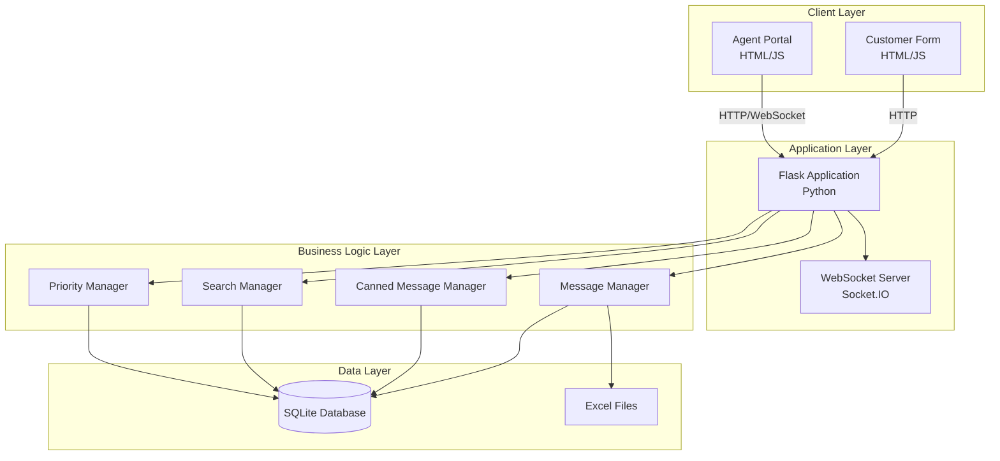

---

## Component Diagram

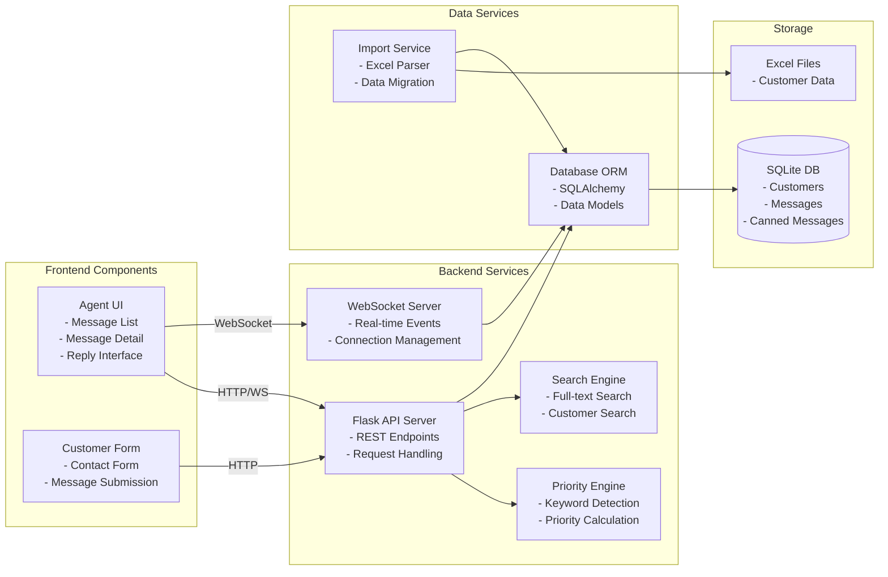

---

## Database Schema

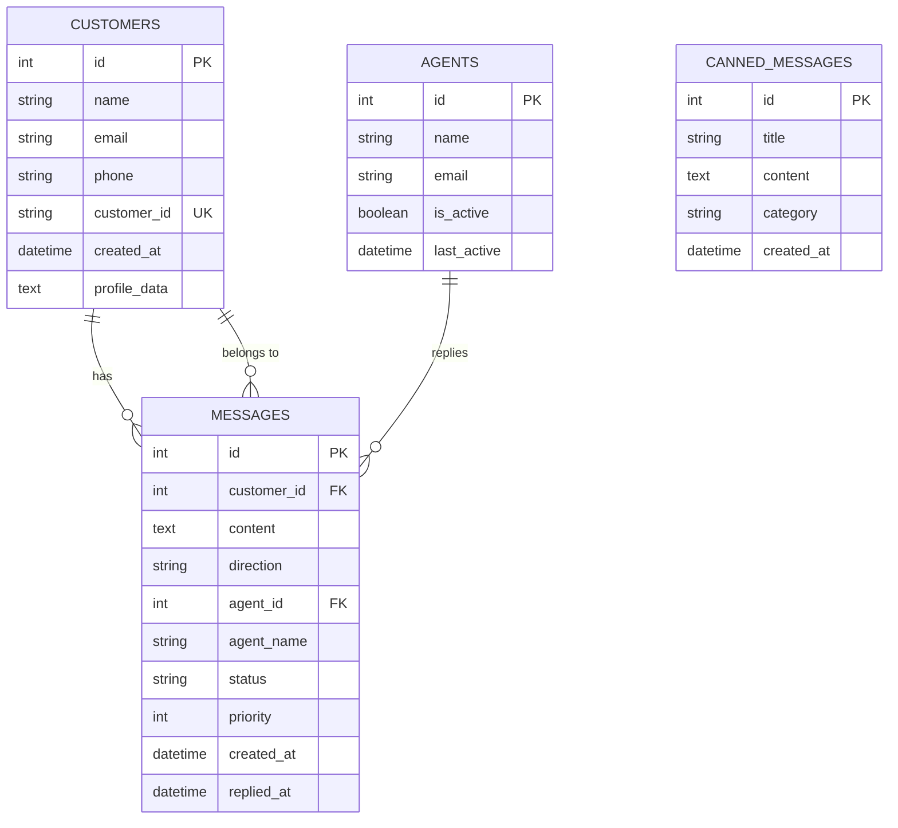

### Database Relationships
- **Customers → Messages**: One-to-Many (One customer can have many messages)
- **Agents → Messages**: One-to-Many (One agent can reply to many messages)
- **Canned Messages**: Standalone table (No foreign keys)

---

## API Architecture

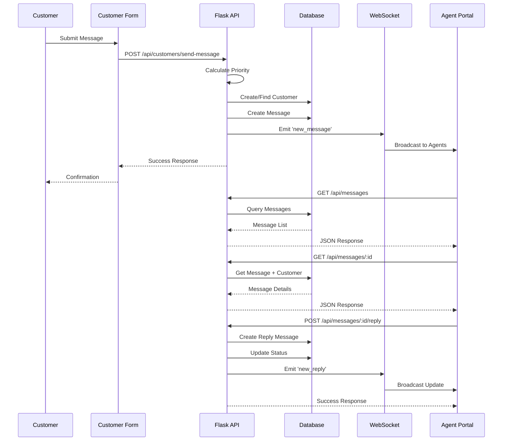

---

## Real-Time Communication Flow

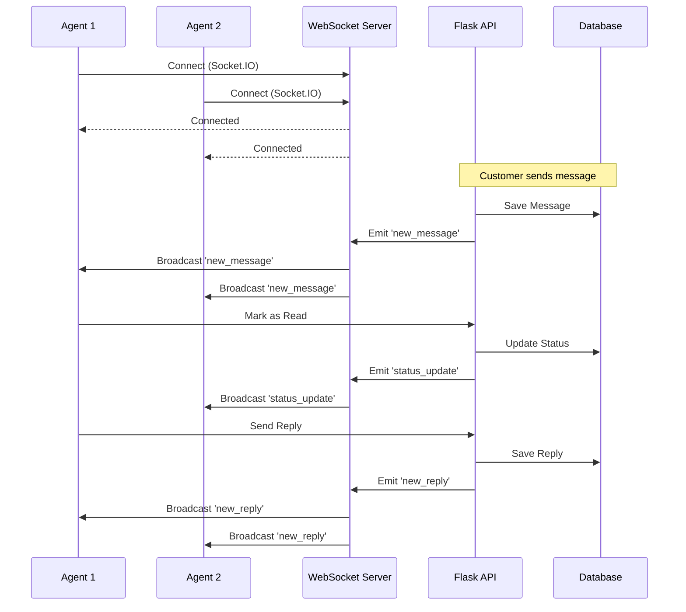

---

## Data Flow Diagram

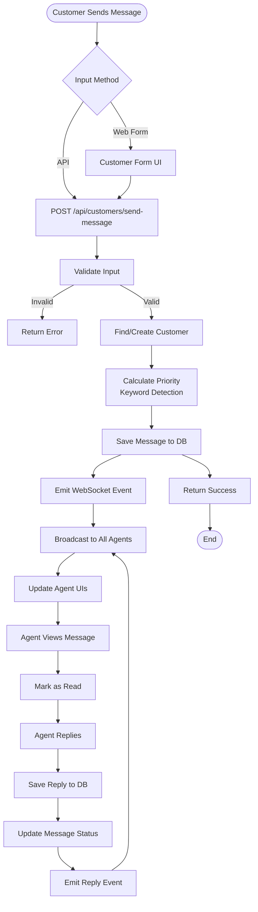

---

## Message Processing Flow

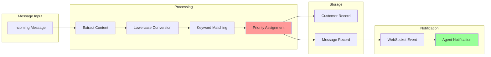

### Priority Detection Algorithm Flow

```
Message Content
    ↓
Convert to Lowercase
    ↓
┌─────────────────────────┐
│ Check High Priority     │
│ Keywords                │
│ (loan approval,         │
│  disbursement, etc.)    │
└─────────────────────────┘
    ↓ (if found)
Priority = 3 (Urgent)
    ↓ (if not found)
┌─────────────────────────┐
│ Check Medium Priority   │
│ Keywords                │
│ (status, update, etc.)  │
└─────────────────────────┘
    ↓ (if found)
Priority = 2 (Medium)
    ↓ (if not found)
┌─────────────────────────┐
│ Check Low Priority      │
│ Keywords                │
│ (how to, change, etc.)  │
└─────────────────────────┘
    ↓ (if found)
Priority = 1 (Low)
    ↓ (if not found)
Priority = 0 (Default)
```

---

## Deployment Architecture

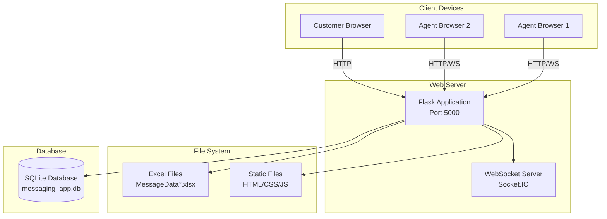

---

## System Components Detail

### 1. Frontend Layer

```
┌─────────────────────────────────────┐
│         Agent Portal UI             │
├─────────────────────────────────────┤
│ • Message List Component            │
│ • Message Detail Component          │
│ • Reply Interface Component         │
│ • Search Component                  │
│ • Filter Component                  │
│ • Canned Message Selector           │
│ • Customer Info Display             │
│ • WebSocket Client                  │
└─────────────────────────────────────┘

┌─────────────────────────────────────┐
│        Customer Form UI             │
├─────────────────────────────────────┤
│ • Contact Form                      │
│ • Message Input                     │
│ • Submit Handler                    │
│ • Success/Error Display             │
└─────────────────────────────────────┘
```

### 2. Backend Layer

```
┌─────────────────────────────────────┐
│         Flask Application           │
├─────────────────────────────────────┤
│ • REST API Routes                   │
│ • Request Handlers                  │
│ • Business Logic                    │
│ • Error Handling                    │
│ • CORS Configuration                │
└─────────────────────────────────────┘

┌─────────────────────────────────────┐
│      WebSocket Server (Socket.IO)   │
├─────────────────────────────────────┤
│ • Connection Management             │
│ • Event Broadcasting                │
│ • Real-time Updates                 │
│ • Client Synchronization            │
└─────────────────────────────────────┘

┌─────────────────────────────────────┐
│      Business Logic Modules         │
├─────────────────────────────────────┤
│ • Priority Calculator               │
│ • Search Engine                     │
│ • Message Manager                   │
│ • Customer Manager                  │
│ • Canned Message Manager            │
└─────────────────────────────────────┘
```

### 3. Data Layer

```
┌─────────────────────────────────────┐
│      SQLAlchemy ORM                 │
├─────────────────────────────────────┤
│ • Customer Model                    │
│ • Message Model                     │
│ • CannedMessage Model               │
│ • Agent Model                       │
│ • Database Sessions                 │
│ • Query Builder                     │
└─────────────────────────────────────┘

┌─────────────────────────────────────┐
│      Data Import Service            │
├─────────────────────────────────────┤
│ • Excel File Reader (Pandas)        │
│ • Column Detection                  │
│ • Data Validation                   │
│ • Duplicate Prevention              │
│ • Batch Insert                      │
└─────────────────────────────────────┘
```

---

## Technology Stack

```
┌─────────────────────────────────────────────┐
│              Technology Stack               │
├─────────────────────────────────────────────┤
│                                             │
│  Frontend:                                  │
│  • HTML5                                    │
│  • CSS3                                     │
│  • Vanilla JavaScript                       │
│  • Socket.IO Client                         │
│                                             │
│  Backend:                                   │
│  • Python 3.x                               │
│  • Flask (Web Framework)                    │
│  • Flask-CORS (CORS Support)                │
│  • Flask-SocketIO (WebSocket)               │
│  • SQLAlchemy (ORM)                         │
│  • Pandas (Data Processing)                 │
│  • OpenPyXL (Excel Reading)                 │
│                                             │
│  Database:                                  │
│  • SQLite (Development)                     │
│  • (PostgreSQL compatible)                  │
│                                             │
│  Real-time:                                 │
│  • Socket.IO                                │
│  • Eventlet (Async Support)                 │
│                                             │
└─────────────────────────────────────────────┘
```

---

## API Endpoint Structure

```
/api
├── /messages
│   ├── GET /                    → List all messages (with filters)
│   ├── GET /<id>                → Get message details
│   ├── POST /<id>/reply         → Reply to message
│   └── POST /<id>/read          → Mark as read
│
├── /customers
│   └── POST /send-message       → Customer sends message
│
├── /canned-messages
│   ├── GET /                    → List all templates
│   └── POST /                   → Create template
│
└── /search
    └── GET /?q=<query>          → Search messages/customers
```

---

## Message Status Lifecycle

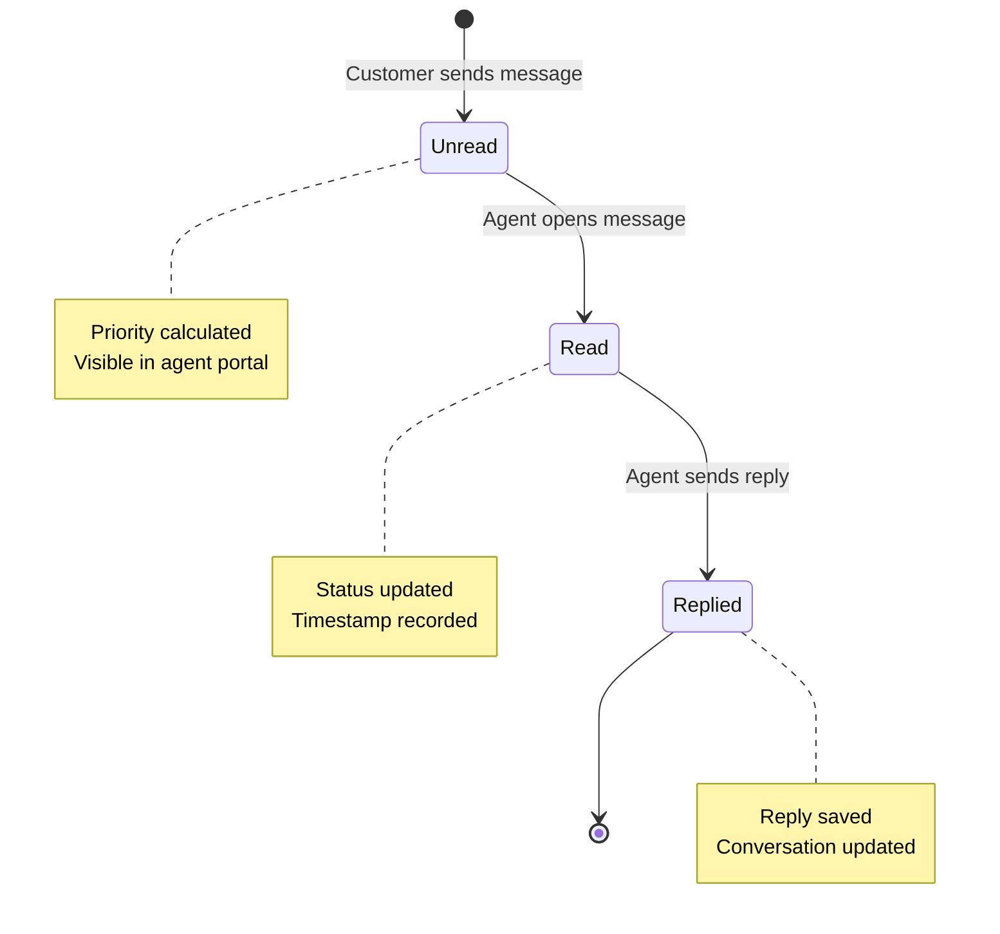

---

## Search Flow

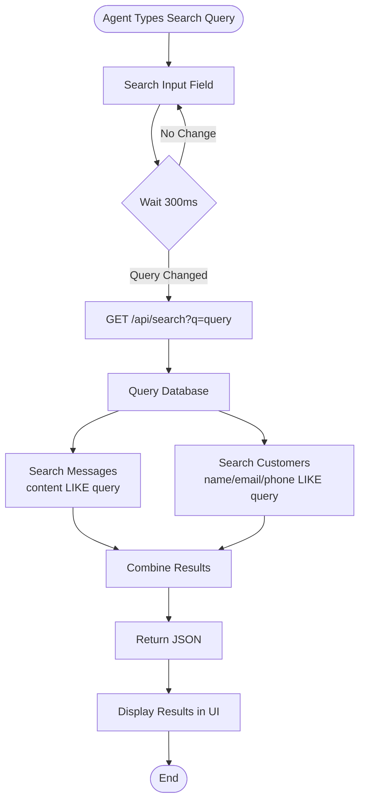

---

## Excel Import Flow

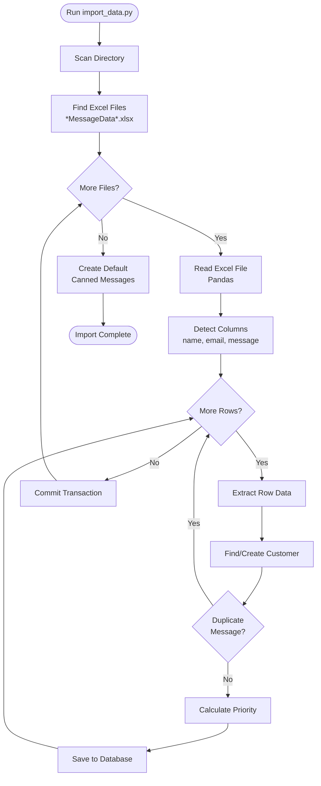

---

## Security Considerations

```
┌─────────────────────────────────────────────┐
│         Security Architecture               │
├─────────────────────────────────────────────┤
│                                             │
│  Current (Demo):                            │
│  • No authentication (simplified)           │
│  • CORS enabled for development             │
│  • SQL injection protection (ORM)           │
│                                             │
│  Production Recommendations:                │
│  • JWT authentication                       │
│  • Role-based access control                │
│  • Rate limiting                            │
│  • Input validation & sanitization          │
│  • HTTPS/SSL                                │
│  • Environment variables for secrets        │
│  • Database connection pooling              │
│  • SQL injection prevention                 │
│  • XSS protection                           │
│                                             │
└─────────────────────────────────────────────┘
```

---

## Scalability Considerations

```
┌─────────────────────────────────────────────┐
│         Scalability Architecture            │
├─────────────────────────────────────────────┤
│                                             │
│  Current:                                   │
│  • Single server instance                   │
│  • SQLite database                          │
│  • In-memory WebSocket connections          │
│                                             │
│  Horizontal Scaling Options:                │
│  • Load balancer (Nginx)                    │
│  • Multiple Flask instances                 │
│  • Redis for WebSocket pub/sub              │
│  • PostgreSQL for database                  │
│  • Message queue (RabbitMQ/Celery)          │
│  • CDN for static assets                    │
│                                             │
│  Vertical Scaling Options:                  │
│  • Increase server resources                │
│  • Database connection pooling              │
│  • Caching layer (Redis)                    │
│                                             │
└─────────────────────────────────────────────┘
```

---

## Performance Optimization

```
┌─────────────────────────────────────────────┐
│      Performance Optimizations              │
├─────────────────────────────────────────────┤
│                                             │
│  Implemented:                               │
│  • Database indexing on key fields          │
│  • Debounced search input                   │
│  • Efficient SQL queries                    │
│  • WebSocket for real-time (no polling)     │
│                                             │
│  Future Optimizations:                      │
│  • Pagination for message lists             │
│  • Lazy loading of conversations            │
│  • Database query optimization              │
│  • Caching frequently accessed data         │
│  • Compression for API responses            │
│  • CDN for static assets                    │
│                                             │
└─────────────────────────────────────────────┘
```

---

*System Design Document Version 1.0*  
*Last Updated: 2024*

